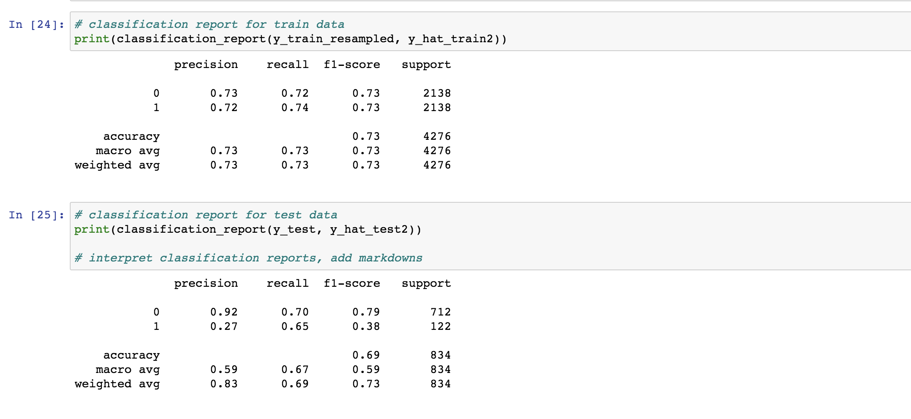
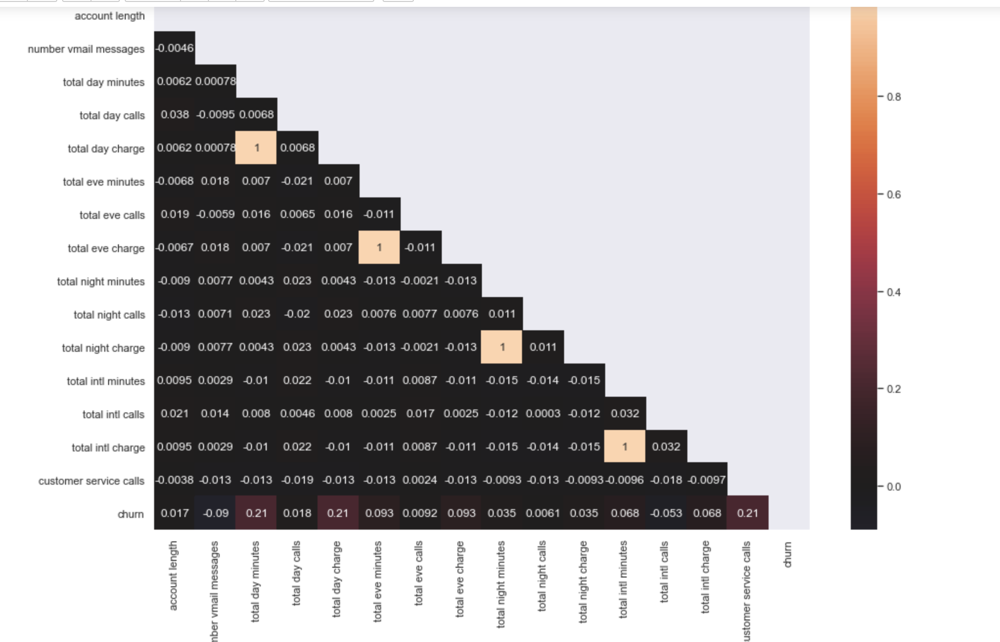

# SyriaTel Customer Churn Analysis
**Authors:** Armun Shakeri

### Overview

This project analyzes SyriaTel Customer Churn dataset to explore if there are any predictable patterns with cutomer turnover. Three ML models will be built to analyze the dataset, the best of the three models will be chosen as the main model to analyze. For each of the models we want to pay close attention to the recall score of each classification report. This score quantifies the number of positive class predictions made out of all positive examples in the dataset.

### Business Problem and Data

SyriaTel is interested in reducing the amount of money lost due to customer turnover. This project seeks to analyze customer data and identify any patterns that lead to customer churn and/or retention. The main goal of this project is to offer three recommendations to SyriaTel to help maintain customers and increase quartlery profits.

### Data

For this project we had SyriaTel's customer churn info, "archive/bigml_59c28831336c6604c800002a.csv". This data set contained 3 columns that were useless for analysis, these columns, "state", "area code", and "phone number", were dropped. We then plotted to data to view any noticable patterns. After those patterns were identified we used onehotencoder to change categorical variables,  "international plan" and "voice mail plan" changing "yes" to 1 and "no" to 0. We will did the same with churn column, but rather than using onehotencoder we used .astype() to change the column to integer. 

### Methods 

The final step in data cleaning was splitting the data using test train plit into feature and target dataframes. We will set X as all variables except "churn" and we will set y to "churn". We will also scaled the X variables for modeling.

### Analysis 

For analysis we decided to use 3 models, logistic regression, DecisionTreeClassifier, and XGBClassifier. The steps for modeling went as follows, build a model, model.predict(), print classification report and confusion matrix for model, and finally determining the fit of the model. The 1st linear regression model did not perform as well as we had expected. To fix this we used SMOTENC to balance the data, by creating synthetic values to balance our existing data. The 2nd model showed higher scores that made this model adequate to use if chosen. The 2nd model was the DecisionTreeClassifier, after tuning this model showed high results on the classification report and promising numbers on the confusion matrix. The final model plotted was the XGBClassifier, fter tuning this model showed perfect scores on the classification report for the training data and near perfect scores on the test data. 

### Evaluation and Conclusion 

After analyzing and evaluating the data set from Syria Tel we have 3 recommendations:

1) Offer bonuses for international customers

2) offer bonuses for minutes used 

2) Focus more on customer service 

For this analysis we will be choosing XGBClassifier as the chosen model. On the classification report it scored perfectly on the training data and had the highest scores in precision, recall, and f1-score. We want to ensure the model runs as accurateltly as possible, meaning we also want the chosen model to have low false positives and true negatives. The XGBClassifier also falls within this category.

### Visuals

Second logistic regression scores

Decision tree classification report

XGBClassifier classification report

Heatmap generated from SyriaTel data 

Feature importances of XGBClassifier

### For More Information

Please review our full analysis in analysis.ipynb or our [presentation](./DS_Project_Presentation.pdf).

For any additional questions, please contact Armun Shakeri ashakeri62@gmail.com 

## Repository Structure

├── archive
├── images
├── analysis.ipynb
├── archive.zip
├── CONTRIBUTING.md
├── LICENSE.pdf
├── Presentation3_compressed (1).pdf 
├── README.md 

